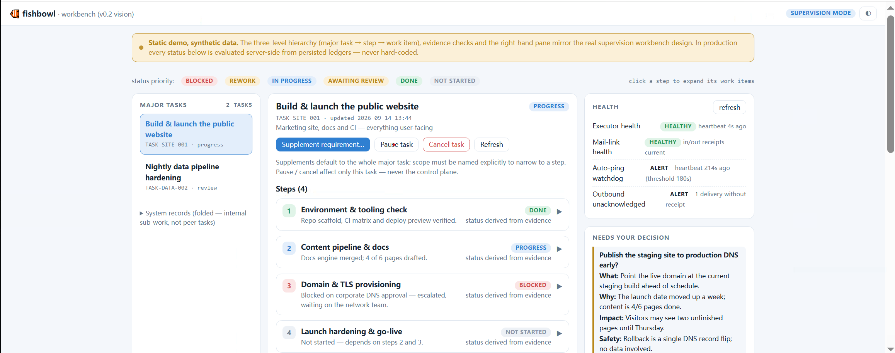

# workflow-fishbowl 🐠

**A local AI agent observability dashboard for Codex and Claude Code.**

[](demo/workbench-demo.html)

See the [interactive static demo](demo/workbench-demo.html) for the full
three-level task view, evidence-derived status, and supervision side panel.
The demo uses synthetic data and does not connect to your local sessions.

workflow-fishbowl is a tiny, read-only local dashboard that shows what your
Codex and Claude Code sessions are doing *right now* — and what they did while you were looking
away. If you have ever left a long agent task running in a terminal, come
back 20 minutes later and wondered *"what is it actually doing?"*,
workflow-fishbowl
is for you.

Use workflow-fishbowl as a **Codex monitor**, **Claude Code monitor**,
**AI agent dashboard**, **local LLM observability tool**, or
**long-running coding-task monitor**. It is designed for developers who want
visibility into agent work without uploading transcripts to a third party.

**中文简介：** workflow-fishbowl 是一个本地、只读的 Codex 与 Claude Code
AI 编程任务监控面板，帮助你查看会话状态、工具调用、卡住的任务、Token
用量和成本估算。

- **Live session list** — every project you work on, grouped, with status
  (active / idle / stalled / archived), the current tool call, and how long
  it has been running.
- **Stall detection** — a tool call that has been pending for 5 minutes with
  a silent transcript gets a red badge. No more guessing whether the agent
  hung or is just thinking hard.
- **Activity timeline** — the full story of a session: prompts, thinking,
  tool calls with durations, errors, subagents.
- **Token & cost stats** — usage by model, per-session cost *estimates* from
  an editable price table.
- **Zero dependencies. No install. Read-only.**

workflow-fishbowl reads the local JSONL transcripts already written by Claude
Code under `~/.claude/projects/` and by Codex under `~/.codex/sessions/`.
It never sends telemetry and never modifies either tool's transcript files.

## Quick start

Requires Python 3.10+. No pip packages — workflow-fishbowl is pure standard
library.

```bash
git clone https://github.com/zonion088-design/workflow-fishbowl.git
cd workflow-fishbowl
python -m fishbowl
```

The command prints the exact local URL. By default it is
<http://127.0.0.1:8765>. If that port is already in use, choose another one:

```bash
python -m fishbowl --port 8877
```

Then open the URL printed in the terminal. `127.0.0.1` always means the
current computer; the dashboard is not exposed to the local network.

Prefer a real install?

```bash
pipx install .
workflow-fishbowl   # same thing, on your PATH
```

## Demo mode

No Codex or Claude Code on this machine? Try the demo — it generates synthetic
sessions (including a deliberately stalled one) and replays a scripted
agent in real time:

```bash
python -m fishbowl --demo
```

## Common use cases

- Monitor a long-running Codex or Claude Code task while it runs.
- Detect a pending tool call that may be stalled.
- Review prompts, reasoning summaries, tool calls, errors, and subagents.
- Compare model token usage and estimated costs locally.
- Inspect sessions without sending transcripts or telemetry to a service.

More focused guides:

- [Codex monitoring](docs/codex-monitoring.md)
- [Claude Code monitoring](docs/claude-code-monitoring.md)
- [AI agent observability](docs/ai-agent-observability.md)
- [中文说明](docs/README.zh-CN.md)

## How it works

```
~/.claude/projects/ ─┐
                     ├─► adapters → incremental scanner → local dashboard
~/.codex/sessions/  ─┘                         127.0.0.1:<port>
```

- **Incremental scanning** — files are `stat()`ed every 2 seconds; only new
  bytes are read and parsed. A multi-hundred-MB transcript history is fine;
  restarts resume from persisted cursors (`~/.fishbowl/state.json`).
- **Half-line safe** — a line that Codex or Claude Code is still writing is
  left for
  the next cycle. Truncated/replaced files are detected and rebuilt.
- **Hostile-input safe** — corrupted JSON, 6 MB attachment lines and empty
  files are skipped or flagged, never crash the scanner.
- **Deterministic keys** — every activity has a stable `file:line` key, so
  rescans are idempotent.

## Configuration

```text
usage: fishbowl [-h] [--demo] [--port PORT] [--root PATH] [--no-cache]
                [--poll POLL] [--open] [--dump] [--version]
```

| Flag | Default | Meaning |
|---|---|---|
| `--demo` | off | run on bundled synthetic data |
| `--port` | 8765 | dashboard port (localhost only) |
| `--root` | `~/.claude/projects` | custom Claude Code transcript root |
| `--no-cache` | off | don't persist scan cursors between runs |
| `--poll` | 2.0 | scan interval in seconds |
| `--open` | off | open the dashboard in a browser on start |
| `--dump` | off | scan once, print JSON snapshot, exit (debugging) |

**Prices**: cost figures are *estimates* from
[fishbowl/prices.json](fishbowl/prices.json).
Every model there is approximate — edit the file freely; unknown models show
"—" instead of a wrong number.

**Thresholds**: "stalled" = a tool call pending > 300 s *and* the session
files silent for > 300 s; "idle" = no activity for 180 s; sessions older
than 30 min without activity are archived. These are constants in
[fishbowl/config.py](fishbowl/config.py) — tweak and go.

## Privacy & security

- **Read-only by construction.** fishbowl opens your transcripts in read
  mode. The HTTP server answers GET only — POST/PUT/DELETE/PATCH return
  `405 read-only service`.
- **Loopback only.** The server binds `127.0.0.1`, hard-coded. There is no
  `--host` flag on purpose. No auth needed because nothing outside your
  machine can reach it.
- **Zero telemetry.** No network calls, no analytics, no crash reporting.
  The only file fishbowl writes is its own cursor cache.
- **Be aware**: transcripts contain your real source code, prompts and
  possibly secrets. fishbowl displays them locally — don't screenshot them
  into public places blindly. (The bundled fixtures and demo data are fully
  synthetic.)

## FAQ

**Does it modify Codex, Claude Code, or my sessions?**
No. workflow-fishbowl is a pure observer.

**Windows / macOS / Linux?**
Yes — stdlib only, no OS-specific code. (Developed and tested on Windows.)

**Does it send my transcripts anywhere?**
No. There is no outbound networking code at all.

**Where are my older sessions?**
Sessions with no activity in the last 30 minutes are grouped under
"archived" — still browsable, just out of the way.

**Will it read huge transcripts?**
Yes — incrementally. First scan of a big history takes a moment; afterwards
only new bytes are parsed.

## Roadmap

- [ ] v0.2: supervision features — approvals, notifications
- [x] Codex adapter (same dashboard, `.codex` sessions)
- [ ] SSE push instead of polling
- [ ] Docker image
- [ ] Timeline filtering / search

## Contributing

See [CONTRIBUTING.md](CONTRIBUTING.md). The one hard rule: **this repo
never contains real transcripts** — fixtures are generated by
[fishbowl/fixtures_gen.py](fishbowl/fixtures_gen.py).

## License

[MIT](LICENSE)
